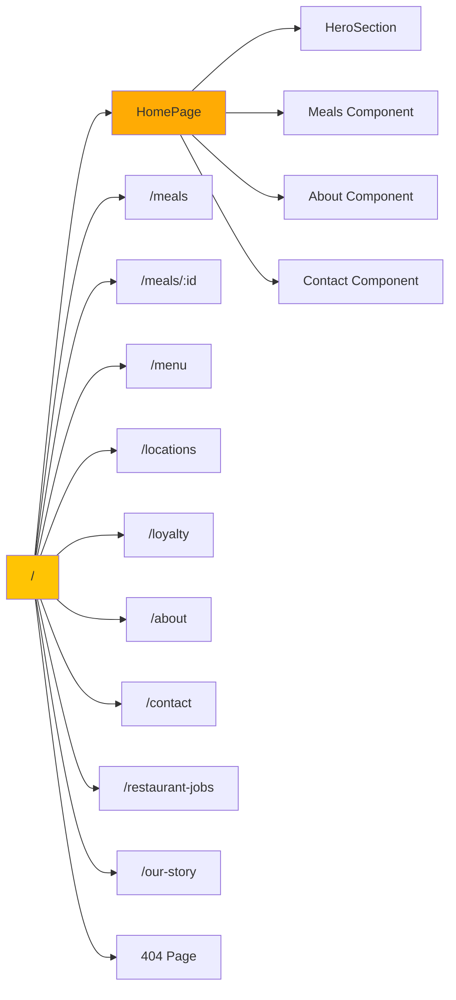
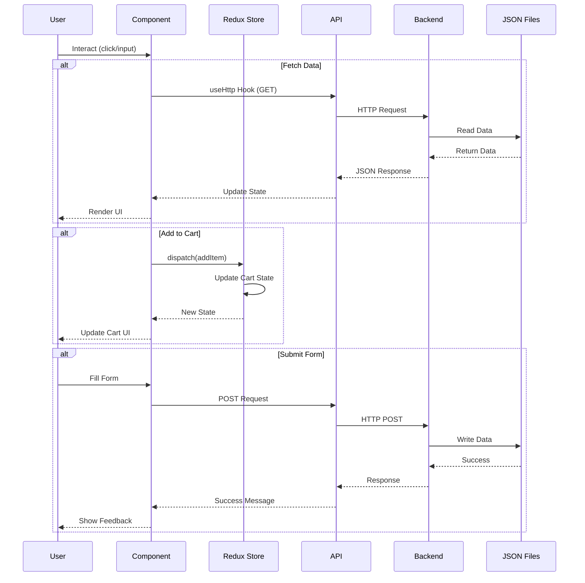
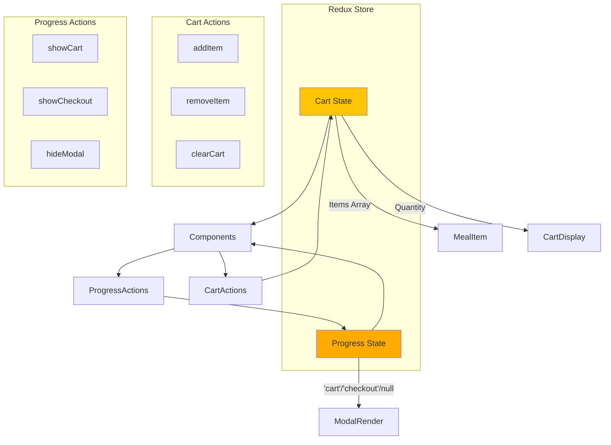
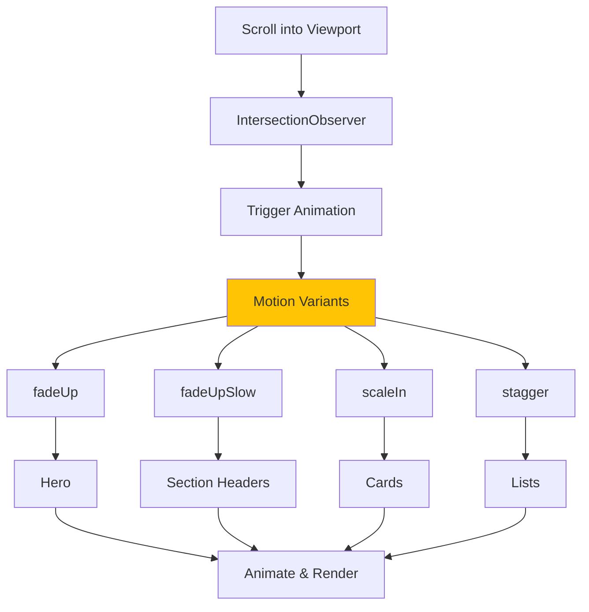
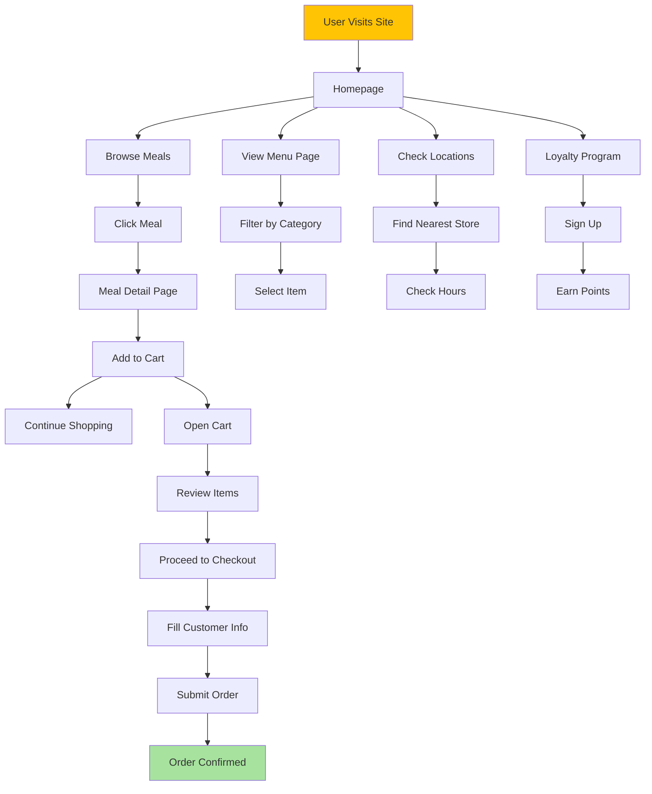
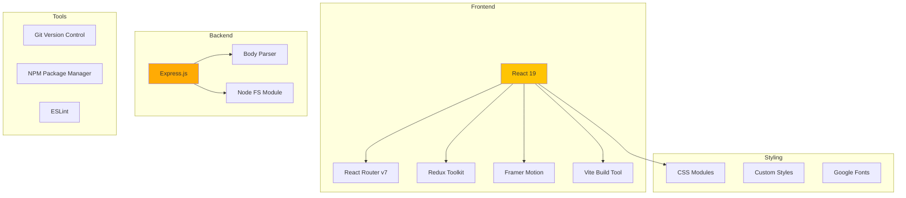
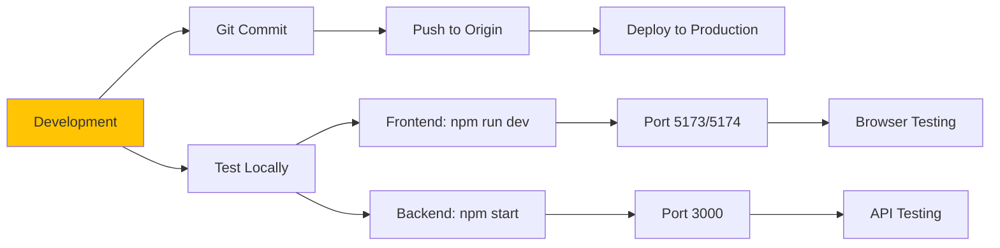

# Rhino_Daizo Application Architecture

## Overall System Architecture

```mermaid
graph TB
    subgraph Client["Frontend (React + Vite)"]
        Browser[Browser]
        Router[React Router]
        Redux[Redux Store]
        Components[React Components]
        Motion[Framer Motion]
    end
    
    subgraph Server["Backend (Express.js)"]
        API[Express API Server]
        Files[Static Files]
        Data[(JSON Data Files)]
    end
    
    Browser --> Router
    Router --> Components
    Components --> Redux
    Components --> Motion
    Components --> API
    API --> Data
    API --> Files
    
    style Client fill:#1f1a09
    style Server fill:#2c1810
```



## Application Routes Structure



## Component Hierarchy

```mermaid
graph TD
    App[Root Layout] --> Header
    App --> Outlet[Page Content]
    App --> Footer
    App --> Cart[Cart Modal]
    App --> Checkout[Checkout Modal]
    
    Header --> Logo
    Header --> NavLinks
    Header --> CartButton
    Header --> Hamburger
    
    Outlet --> HomePage
    Outlet --> MealsPage
    Outlet --> MenuPage
    Outlet --> LocationsPage
    Outlet --> LoyaltyPage
    Outlet --> AboutPage
    Outlet --> ContactPage
    Outlet --> JobsPage
    Outlet --> StoryPage
    
    HomePage --> HeroSection
    HomePage --> MealsSection
    HomePage --> AboutSection
    HomePage --> ContactSection
    
    MealsSection --> MealItem1[MealItem]
    MealsSection --> MealItem2[MealItem]
    MealsSection --> MealItemN[MealItem...]
    
    MealItem1 --> MealDetail[Click → /meals/:id]
    
    style App fill:#ffc404
    style Header fill:#ffab04
    style Outlet fill:#1f1a09
```



## Data Flow Architecture



## State Management (Redux)



## API Endpoints

```mermaid
graph LR
    subgraph Backend API
        GET1[GET /meals]
        GET2[GET /meals/:id]
        POST1[POST /orders]
        POST2[POST /contact]
    end
    
    subgraph Data Files
        MealsJSON[available-meals.json]
        OrdersJSON[orders.json]
        ContactJSON[contact.json]
    end
    
    GET1 --> MealsJSON
    GET2 --> MealsJSON
    POST1 --> OrdersJSON
    POST2 --> ContactJSON
    
    style Backend fill:#2c1810
```



## Animation Flow (Framer Motion)



## User Journey Flow



## Technology Stack



## File Structure Overview

```
Rhino_Daizo App/
├── backend/
│   ├── app.js              → Express server
│   ├── package.json        → Backend dependencies
│   ├── data/               → JSON data storage
│   │   ├── available-meals.json
│   │   ├── orders.json
│   │   └── contact.json
│   └── public/             → Static assets
│       └── images/
│
├── src/
│   ├── main.jsx            → App entry point
│   ├── Root.jsx            → Root layout
│   ├── components/         → React components
│   │   ├── Header.jsx
│   │   ├── Footer/
│   │   ├── Meals.jsx
│   │   ├── MealItem.jsx
│   │   ├── MenuDetail.jsx
│   │   ├── Locations.jsx
│   │   ├── Loyalty.jsx
│   │   ├── About/
│   │   ├── Contact/
│   │   ├── OurStory/
│   │   ├── Restaurant-jobs/
│   │   ├── UI/             → Reusable UI components
│   │   └── css/            → Component styles
│   │
│   ├── pages/              → Page components
│   │   ├── HomePage.jsx
│   │   ├── MenuPage.jsx
│   │   ├── LocationsPage.jsx
│   │   └── ...
│   │
│   ├── routes/
│   │   └── routes.jsx      → Route definitions
│   │
│   ├── Store/              → Redux store
│   │   ├── CartRedux.js    → Cart slice
│   │   └── Progress.js     → Progress slice
│   │
│   ├── Hooks/
│   │   └── useHttp.js      → Custom fetch hook
│   │
│   ├── Utils/
│   │   ├── CurrencyFormatter.js
│   │   └── motionVariants.js
│   │
│   └── styles/             → Global styles
│       ├── globals.css
│       ├── base.css
│       └── ...
│
├── package.json            → Frontend dependencies
├── vite.config.js          → Vite configuration
└── index.html              → HTML entry
```

---

## Key Features

### 1. **Dynamic Meal System**
- Fetches meals from backend API
- Individual meal detail pages
- Add to cart functionality
- Real-time cart updates

### 2. **Smooth Animations**
- Scroll-triggered animations via Framer Motion
- Fade, scale, and stagger effects
- Viewport-aware loading
- Respects reduced-motion preferences

### 3. **State Management**
- Redux Toolkit for global state
- Cart state management
- Modal/progress state
- Persistent across navigation

### 4. **Responsive Design**
- Mobile-first approach
- Hamburger menu for mobile
- Flexible grid layouts
- Adaptive typography

### 5. **Form Handling**
- Contact form submission
- Job application form
- Checkout process
- Form validation

### 6. **Multiple Pages**
- Home (Hero + Meals + About + Contact)
- Menu with category filters
- Locations with store info
- Loyalty rewards program
- About page with flip cards
- Contact page with form
- Jobs application page
- Our Story timeline

---

## Development Workflow



---

**Created:** January 4, 2026  
**Version:** 1.0.0
